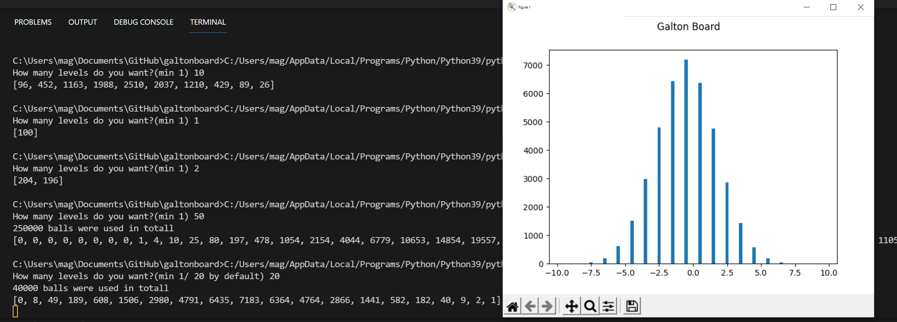

# Galton Board

A project where we make a galton board in Python.

There are two versions:
- Just the algorithm. I determines the number of balls in each of the lanes
- Using the same algorithm as before but representing it in a chart

